```{r setup, include=FALSE}
options(htmltools.dir.version = FALSE)
knitr::opts_chunk$set(
  fig.width=9, fig.height=3.5, fig.retina=3,
  out.width = "100%",
  cache = FALSE,
  echo = TRUE,
  message = FALSE, 
  warning = FALSE,
  hiline = TRUE
)
```

```{r xaringan-themer, include=FALSE, warning=FALSE}
library(xaringanthemer)
library(plotly)
library(purrr)
library(readr)
style_duo_accent(
  primary_color = "#3695A8",
  secondary_color = "#e2fcee",
  inverse_header_color = "#EC429D",
  header_font_google = google_font("Montserrat", "300", family = "semibold"),
  text_font_google   = google_font("Roboto", "300", "300i", family = "medium"),
  code_font_google   = google_font("Fira Mono"),
  text_font_size = 2, 
  title_slide_background_color = "#369CA8", 
  title_slide_text_color = "#d0e340"
)
```
<style>
div.footnotes {
  position: absolute;
  bottom: 0;
  margin-bottom: 10px;
  width: 80%;
  font-size: 0.6em;
}
.nobullet li {
  list-style-type: none;
}
.red { color: red; 
  font-weight: bold;
}
.green { color: green; 
  font-weight: bold;
}
.black { color: black; 
  font-weight: bold;
}
.center2 {
  margin: 0;
  position: absolute;
  top: 50%;
  left: 50%;
  -ms-transform: translate(-50%, -50%);
  transform: translate(-50%, -50%);
}

.orange {
color: #dd8d29;
}

</style>


# Introducción

El presente análisis tiene como objetivo mostrar los resultados presentados por la **Encuesta Nacional de Seguridad Pública Urbana (ENSU)** en la ciudad de  Guadalajara  y mostrar cómo dichos resultados se comparan con el promedio de todas las ciudades consideradas por dicha encuesta a nivel nacional.

La ENSU **se enfoca en medir la percepción de seguridad pública** de la población mayor de 18 años residente de las principales ciudades de México. Esta encuesta se realiza desde el tercer trimestre de 2013 y sirve como un seguimiento trimestral de temas tratados de manera anual y a mayor profundidad por la Encuesta Nacional de Victimización y Percepción sobre Seguridad Pública (ENVIPE).


---

# Introducción

El tamaño muestral de la ENSU, ha aumentado a lo largo de los trimestres volviéndose más representativa:


```{r, echo=FALSE}
table_header <- c("Periodo de referencia*", "Unidades de observación", "Población objeto de estudio", "Tamaño de muestra", "Cobertura geográfica")
table_body <- c("Del 1° Trimestre de 2018 a 1° Trimestre de 2023 ",
                "Las viviendas seleccionadas, los hogares y los residentes del hogar y las personas seleccionadas en el hogar", 
                "Población de 18 años y más", 
                "20,400-27,250 viviendas a nivel nacional y 245-271 viviendas en Guadalajara", 
                "75 ciudades a nivel nacional y 6 en Jalisco ")

table_frame <- data.frame(table_body)
row.names(table_frame) <- table_header
table <- kableExtra::kable_styling(kableExtra::column_spec(knitr::kable(table_frame, format="html"), 1, bold=TRUE))
gsub("<thead>.*</thead>", "", table)
```


*Fuente*: Documentación de ENSU (INEGI).

.footnote[\* *Nota*: Debido a la pandemia ocasionada por el COVID-19, no se realizó la ENSU del segundo trimestre de 2020.]

---

# Introducción

INEGI utiliza el **coeficiente de variación** (CV)*  para determinar si las estimaciones de la ENSU son precisas, de acuerdo a los siguientes parámetros:
* Alto si el CV se encuentra entre 0% y 15%.

* Moderado si el CV se encuentra entre 15% y 30%.

* Bajo si el CV es mayor a 30%.

En el presente documento se consideraron estos parámetros al momento de analizar los resultados nacionales y de Guadalajara, todos los datos aquí presentados son estimaciones significativas, es decir por debajo del umbral del 30% en sus coeficiente de variación.

.footnote[\* El coeficiente de variación es una medida de tendencia central que nos indica la desviación de los datos observados con respecto a la media y, al mismo tiempo, las dispersiones que tienen los datos dispersos entre sí. Se calcula dividiendo la desviación estándar de la muestra, entre la media de la muestra. ]

---

# Introducción

La **cobertura temática de la ENSU** es la siguiente:
* Sensación de inseguridad por temor al delito.
* Expectativa sobre la tendencia del delito.
* Atestiguación de conductas delictivas o antisociales.
* Cambio de rutinas por temor a ser víctimas del delito.
* Formas y/o medios de comunicación para enterarse de la seguridad pública.
* Victimización delictiva.
* Desempeño de la policía como autoridad de seguridad pública.
* Conflictos y conductas antisociales.
* Desempeño gubernamental.
* Corrupción.
* Experiencias de acoso personal y violencia sexual.

---
class: inverse center middle

# Percepción de inseguridad

---
## Evolución en la percepción de inseguridad 
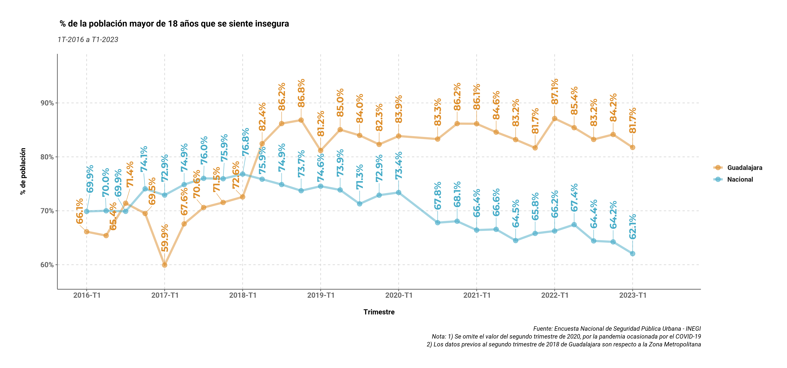

---

class: inverse center middle

### Evolución en la percepción de inseguridad 


La **percepción de inseguridad de Guadalajara es mayor a la nacional** desde el segundo trimestre de 2018. La diferencia más alta ocurrió en el primer trimestre de 2022  con 20.9 puntos de diferencia entre el dato nacional y Guadalajara. Actualmente esa diferencia se reduce a 18.7%.

La percepción de inseguridad a nivel nacional se sigue manteniendo a la baja, mientras que Guadalajara se recuperó de su peor calificación y se encuentra al mismo nivel que a finales de 2021.

El descenso en la percepción de inseguridad es tendencia nacional, lo que impica que los datos de Guadalajara podrían entrar en esa tendencia y no ser datos intrínsecos.

---

### Percepción de inseguridad en la ZMG

.pull-left[
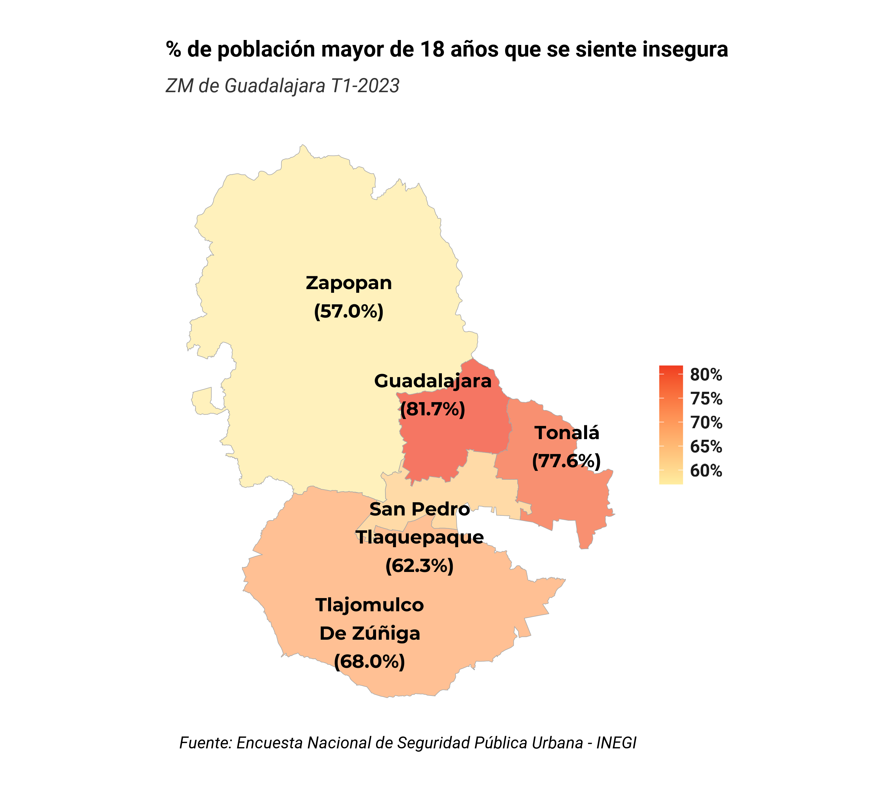
]

.pull-right[
<p align="center">

```{r echo=FALSE, message=FALSE, warning=FALSE, include = FALSE}
tabla_perc <- read_csv("04_temp/tabla_perc.csv")
tabla_camhab <- read_csv("04_temp/tabla_camhab.csv")
tabla_lugares <- read_csv("04_temp/tabla_lugares.csv")
tabla_programas <- read_csv("04_temp/tabla_conoc_program.csv")
```
```{r echo=FALSE, message=FALSE, warning=FALSE}
kableExtra::kable_styling(kableExtra::column_spec(knitr::kable(tabla_perc, format="html"), 1, bold=TRUE), font_size = 12) 
```
</p>

]
---
## Percepción en capitales

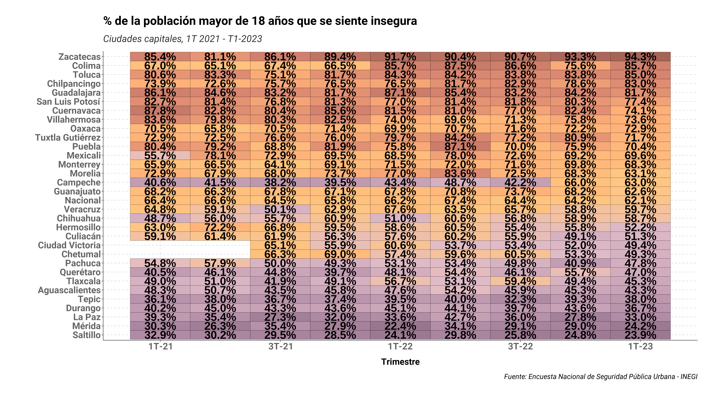
---

## Percepción en capitales

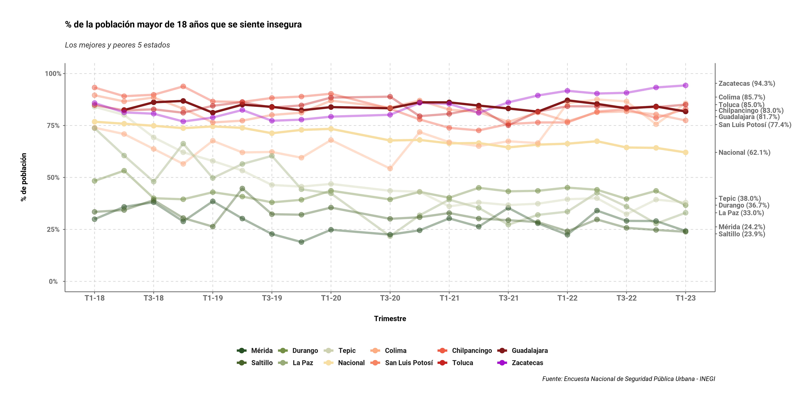
---

class: inverse center middle

Entre el cuarto trimestre de 2022 y el primero de 2023, la recuperación en la percepción de inseguridad permitió que .green[Guadalajara bajara del segundo al quinto lugar] en la percepción de inseguridad de capitales del país.

Zacatecas (PVEM), Colima (PAN), Toluca (PRI) y Chilpancingo (Morena) son las capitales con mayor índice de percepción de inseguridad.
---

## Percepción de inseguridad en Metrópolis

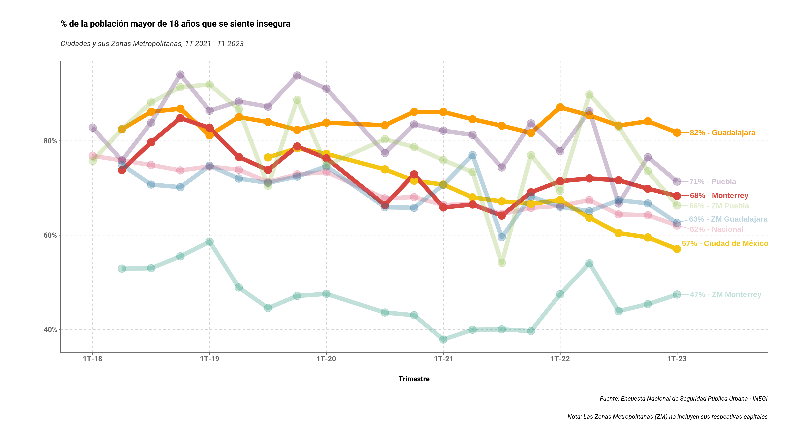

---
class: inverse center middle

### Percepción de inseguridad en Metrópolis
Al comparar las áreas metropolitanas más importantes del país,   **Guadalajara**  presenta los niveles más altos en percepción de inseguridad, pero su zona metropolitana queda por debajo de Puebla, que mantiene un comportamiento errático.

Cabe señalar que todas las áreas metropolitanas mantienen una tendencia a la baja desde el año pasado a excepción de la Zona Metropolitana de Monterrey.
---
### Sensación de inseguridad en espacio público


.pull-left[
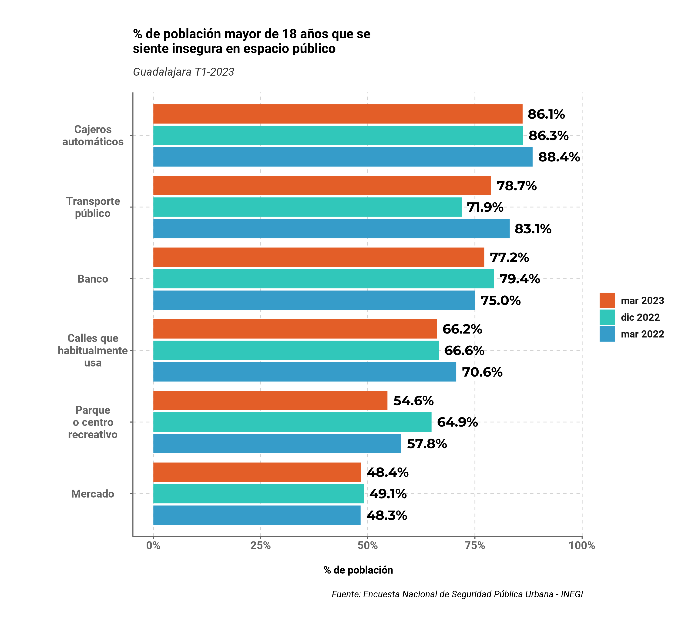
]

.pull-right[

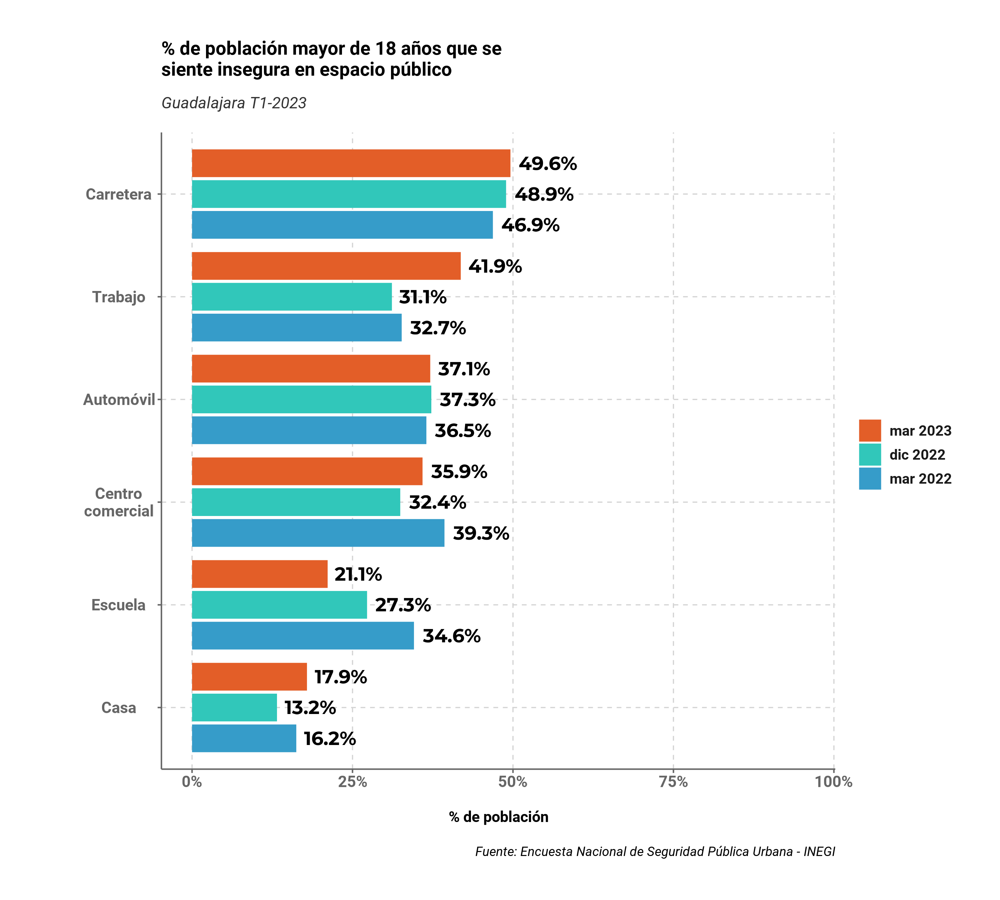

]

---

### Sensación de inseguridad en espacio público


.pull-left[

El primer trimestre de 2022 fue el peor índice registrado para Guadalajara. A un año, el índice se ha reducido 5.4 puntos. Sin embargo, **hay  espacios públicos que se mantienen a la alza**, como el caso de las carreteras (+2.7pp) y los bancos (+2.2pp).

.red[El índice que más subio respecto al año anterior fue el de Trabajo] (+9.2pp), ya que **la mayoría de las empresas han regresado a la presencialidad total**.

Respecto al **trimestre anterior**, los índices que más subieron fueron los de **Trabajo** (+10.7pp), **Transporte Público** (+6.8pp) y **Casa** (+4.7pp).


]

.pull-right[
```{r echo=FALSE, message=FALSE, warning=FALSE}
kableExtra::kable_styling(kableExtra::column_spec(knitr::kable(tabla_lugares, format="html"), 1, bold=TRUE), font_size = 10) 
```
]

---

### Sensación de inseguridad en espacio público


.pull-left[

Desde **el regreso a clases** en el último trimestre de 2020, la percepción de inseguridad en la escuela se **disparó a 72.5%**. Este índice poco a poco se ha reducido conforme se regula la asistencia escolar, por lo que se espera que el índice  en el trabajo se reduzca de la misma manera.

Además, el índice presenta un crecimiento en la percepción de inseguridad en el **Transporte Público** y en la **Casa**, lo que refuerza la idea del retorno a la presencialidad a los espacios laborales.

Aún con ese crecimiento, se percibe .green[mayor seguridad] en la **Casa** (17.9%), seguido de la **Escuela** (21.1%) y el **Centro comercial** (35.9%).
]

.pull-right[
```{r echo=FALSE, message=FALSE, warning=FALSE}
kableExtra::kable_styling(kableExtra::column_spec(knitr::kable(tabla_lugares, format="html"), 1, bold=TRUE), font_size = 10) 
```
]
---
class: inverse center middle

# Experiencias de inseguridad

---

### Experiencias de inseguridad

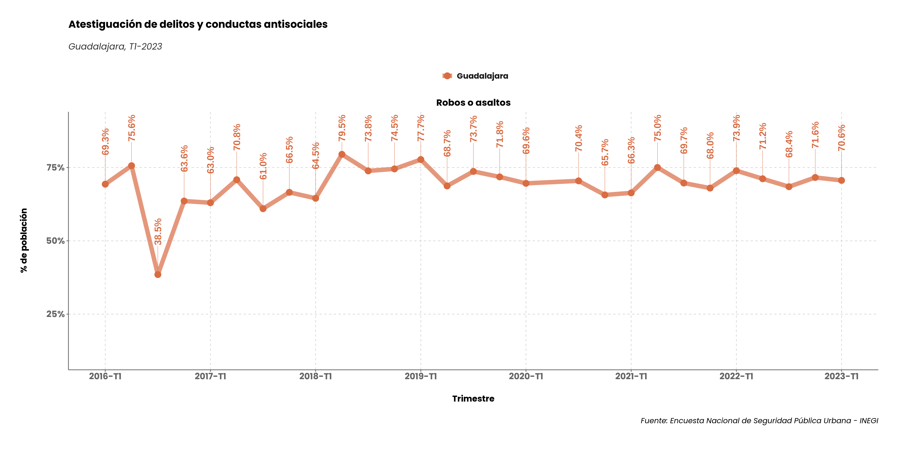

---

### Experiencias de inseguridad

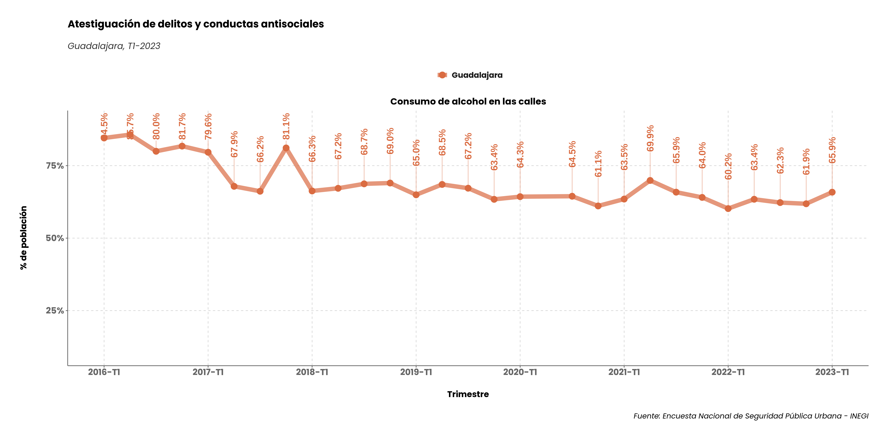
---

### Experiencias de inseguridad

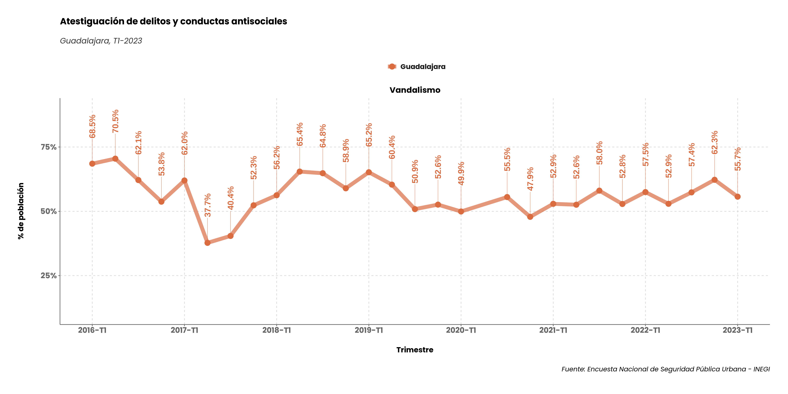
---

### Experiencias de inseguridad

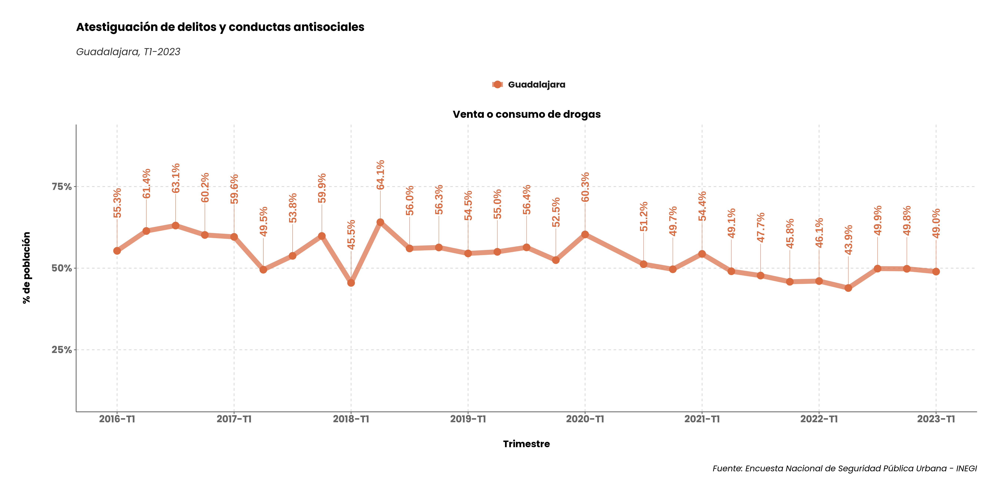
---

### Experiencias de inseguridad

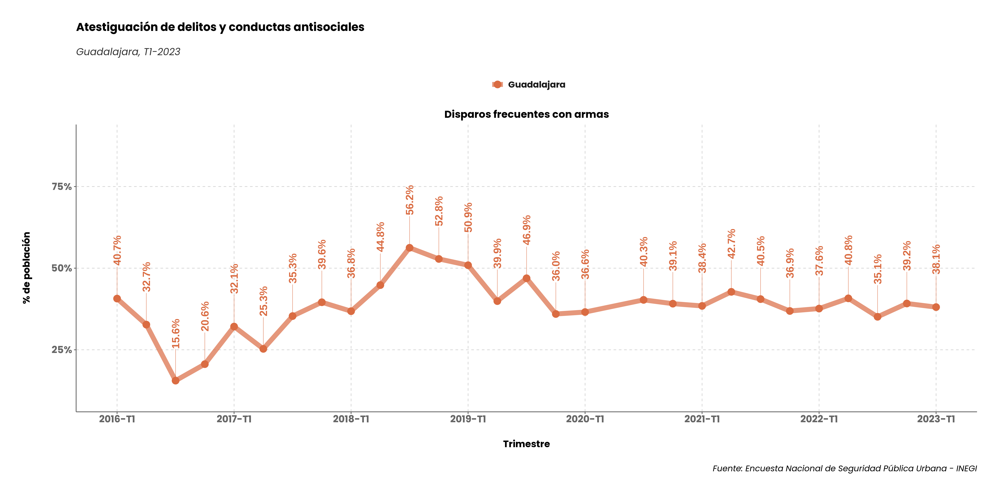
---

### Experiencias de inseguridad

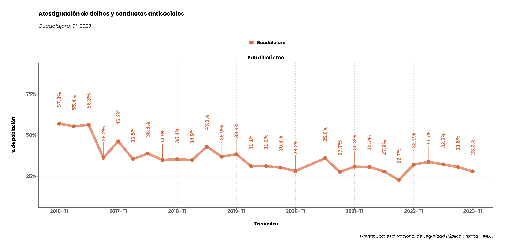
---
class: inverse center middle

### Experiencias de inseguridad

En el primer trimestre de 2023, el delito más percibido por la población de Guadalajara fue **robo o asalto** (70.6%),**consumo de alcohol en vía pública** (65.9%) y  **vandalismo** (55.7%). Todos los índices se redujeron a excepción del consumo de alcohol en vía pública, que subió 5 puntos.


---
class: inverse center middle

# Condición de victimización en hogares

---

### Condición de victimización en hogares

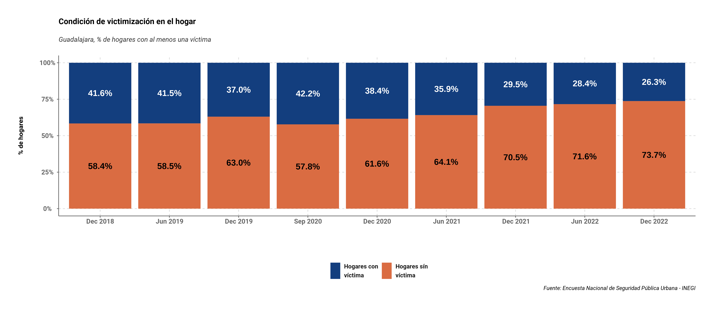

.footnote[\* La sección de víctimas solo se incluye en junio y diciembre a excepción de 2020 que se levantó en septiembre y diciembre.]

---
### Tipo de víctimas en el hogar

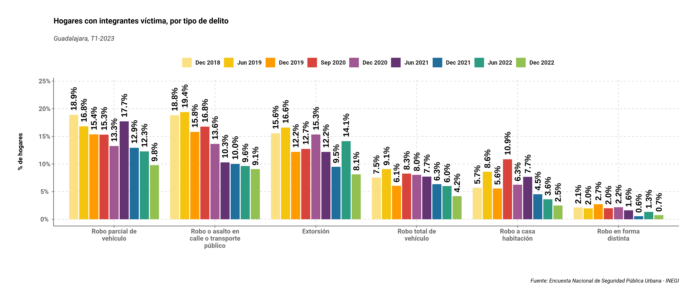
---
### La distancia entre la percepción y la victimización 
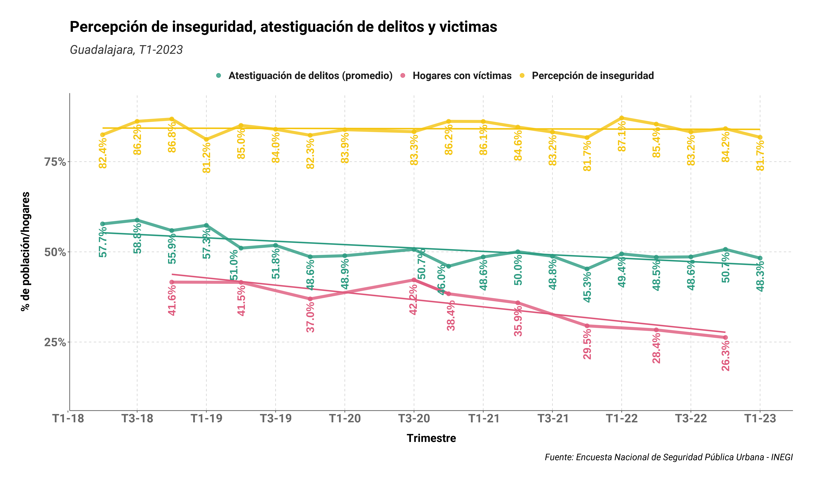

---
class: inverse center middle

### Diagnóstico de tendencias
A pesar de que la atestiguación de delitos y la cantidad de hogares con víctimas mantienen una tendencia a la baja, **la tendencia de percepción de inseguridad se mantiene por encima del 80%**. Sin embargo, cabe aclarar que esta tendencia tiene una ligera inclinación a la baja.

---

### Cambio de hábitos por inseguridad

.pull-left[

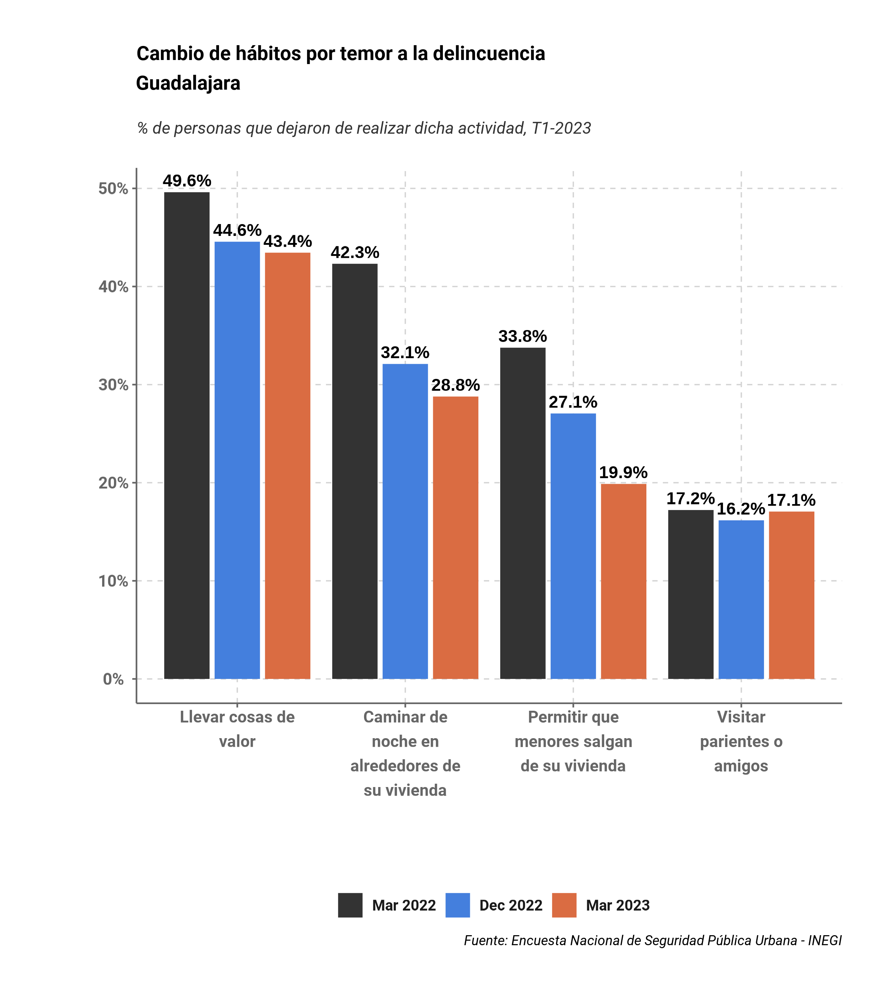
]


.pull-right[

Otro dato que demuestra la sensación de inseguridad real de la población es **el cambio de hábitos por inseguridad**, que **también se ha reducido** en comparación al primer trimestre de 2022, en especial el negar el permiso de menores para salir a la calle, que pasa del 33.8% en 2022 al 19.9% en 2023.
]

---

### Causas de conflictos en municipios de la ZM de Guadalajara

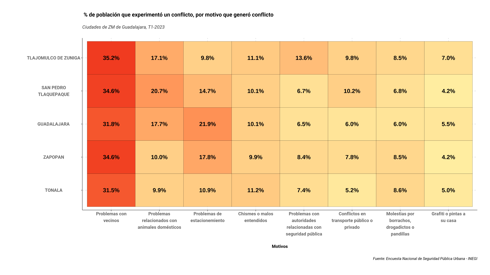

---
## Principales problemas en Guadalajara
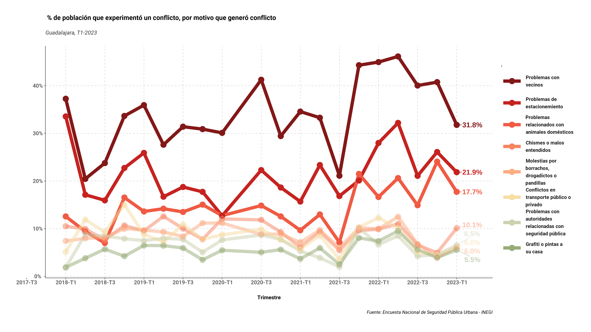
---
class:inverse center middle
### Principales problemas en Guadalajara

Los tres principales problemas de la ciudad se mantienen: **Problemas con vecinos**, **Problemas de estacionamiento** y **Problemas relacionados con animales domésticos** pero cuentan con una drástica mejora en su incidencia, en especial los Problemas con vecinos que pasó del 40.8% al 31.8% en solo un trimestre.

El incremento de atestiguación de consumo de alcohol en las calles también se refleja con el incremento de molestas ocasionadas por borrachos, drogadictos o pandillas.

---

## Principales problemas en Guadalajara
.pull-left[
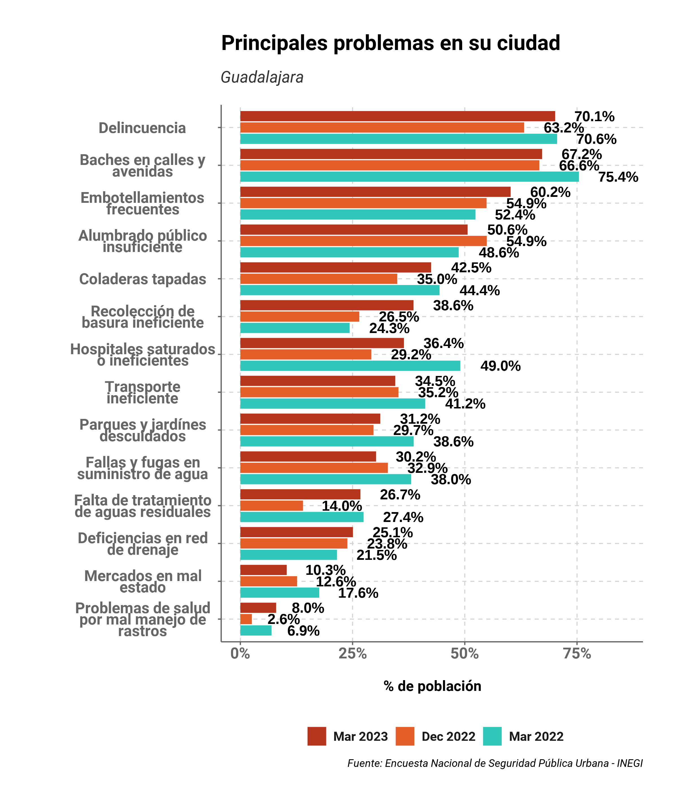
]

.pull-right[
La recolección de basura ha crecido más que cualquier otra problemática; casi .red[4 de cada 10 tapatíos] se quejan de esto.

Otros temas que se han complicado son la **Falta de tratamiento de aguas residuales** (+12.7), **Coladeras tapadas** (+7.5%), **Hospitales saturados o ineficientes** (+7.2%), **Delincuencia** (+6.9%), **Problemas de salud por mal manejo de rastros** (+5.4%) y **Embotellamientos** (+5.3%).

La .red[Delincuencia], .red[Movilidad] y .red[Alumbrado público] son los problemas con mayores agravantes. El resto de los problemas se han mantenido dentro de un porcentaje con una representación porcentual baja, por lo que no se puede mencionar si han mejorado o empeorado.
]
---
## Principales problemas en Guadalajara
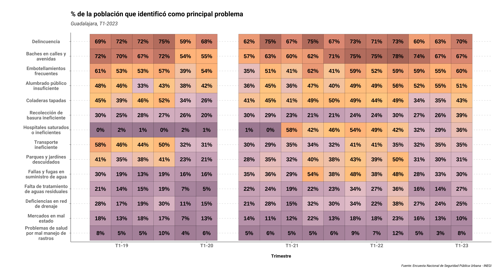

---
class: inverse center middle

# (Des) Confianza en las autoridades
---
### (Des) Confianza en autoridades de seguridad pública

.pull-left[
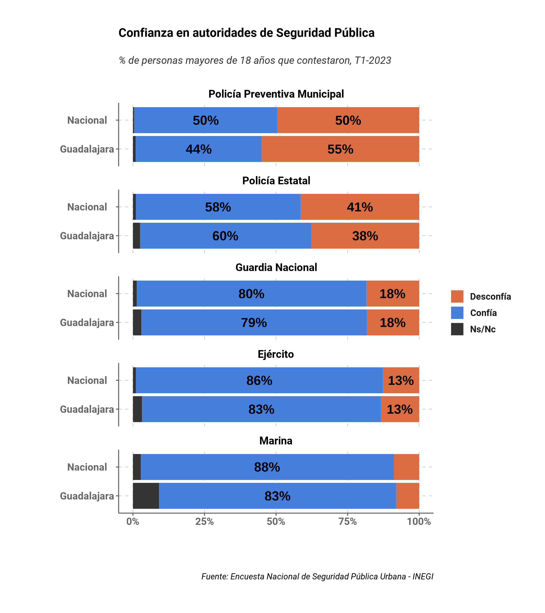
]
.pull-right[
**La Policía Preventiva Municipal continúa siendo la peor calificada** en Guadalajara, mientras que el resto de las autoridades se encuentran al nivel o un poco mejor que el promedio nacional.
]

---
### Confianza en autoridades de seguridad pública

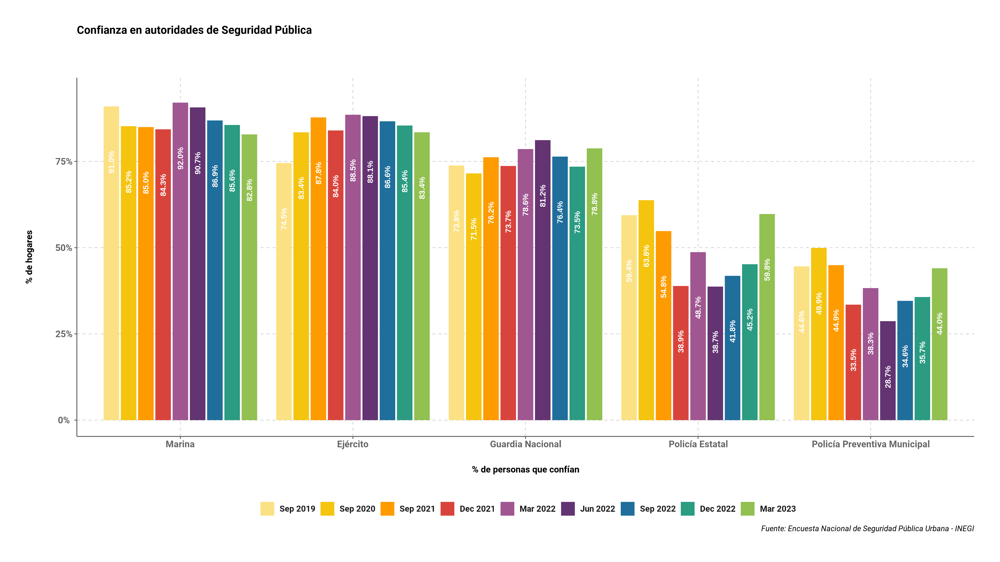
---
### Confianza en autoridades de seguridad pública

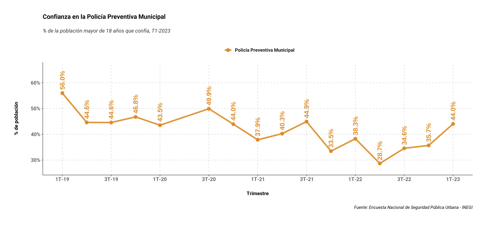
---
### .orange[Percepción de desempeño de autoridades de seguridad pública]

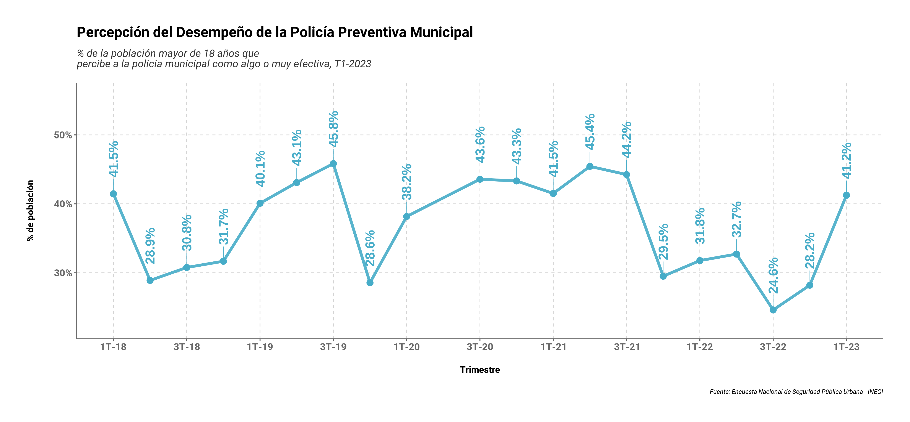

---
class:inverse center middle
### Confianza y percepción de autoridades de seguridad pública
A pesar de ser la autoridad peor calificada, **la Policía Preventiva Municipal ha incrementado su confianza** y sigue aumentando desde su punto más bajo en el segundo trimestre de 2022, cuando contó con apenas el 28.7% de confianza.  

De igual manera, **la confianza en la Policía Estatal ha aumentado** y ahora se encuentra cerca del 60%, mientras que **el Ejército y la Marina mantienen una reducción cada trimestre** que ya comienza a ser representativa: en marzo de 2022, la Marina contaba con el 92% de confianza y ahora solo cuenta con 82.8%, mientras que el Ejército contaba con el 88.5% el año pasado y ahora se ubica en el 83.4%.

---
## Efectividad del gobierno
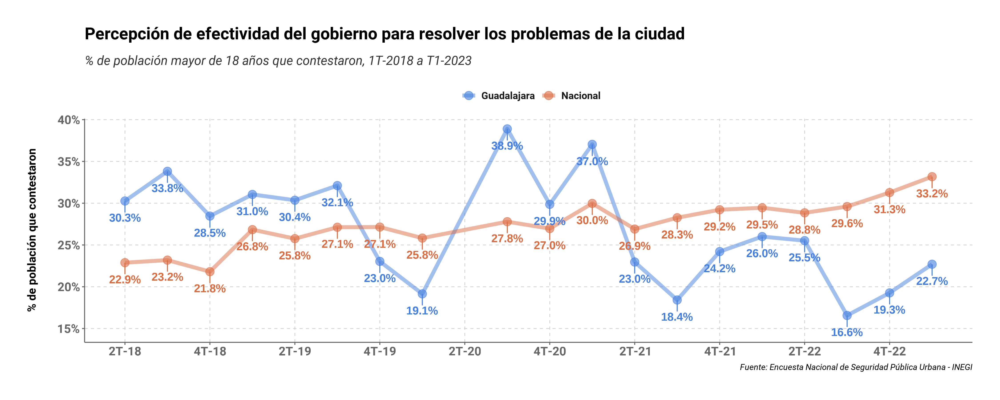

**La percepción de efectividad sigue siendo muy volátil** y desde 2019 se ha encontrado cuatro veces por debajo del 20%. Actualmente se encuentra en el 22.7% y **ha ido mejorando desde el tercer trimestre de 2022**. Sin embargo, aún no se puede considerar como tendencia debido a la misma volatilidad.
---

### Corrupción por parte de autoridades de seguridad pública

.pull-left[
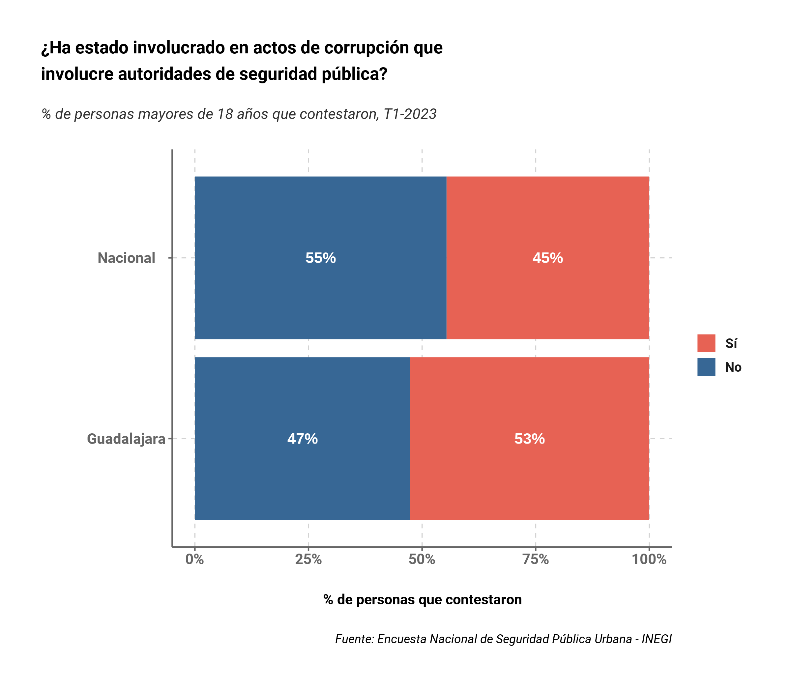
]

.pull-right[
Las experiencias de corrupción se calculan cada seis meses, por lo que aún no se cuenta con información actualizada sobre el tema.

**La mitad de los tapatíos continúan declarando que han tenido experiencias de corrupción** donde algún miembro de las autoridades de seguridad pública le insinuó, le pidió de forma directa o generó las condiciones para que les diera dinero, un regalo o favor para agilizar, aprobar, o bien, evitar infracciones o detenciones. 

El porcentaje nacional por estas mismas experiencias es de 45%, por lo que los tapatíos reportan con mayor frecuencia ese tipo de acciones.

]

---
### Corrupción por parte de autoridades de seguridad pública
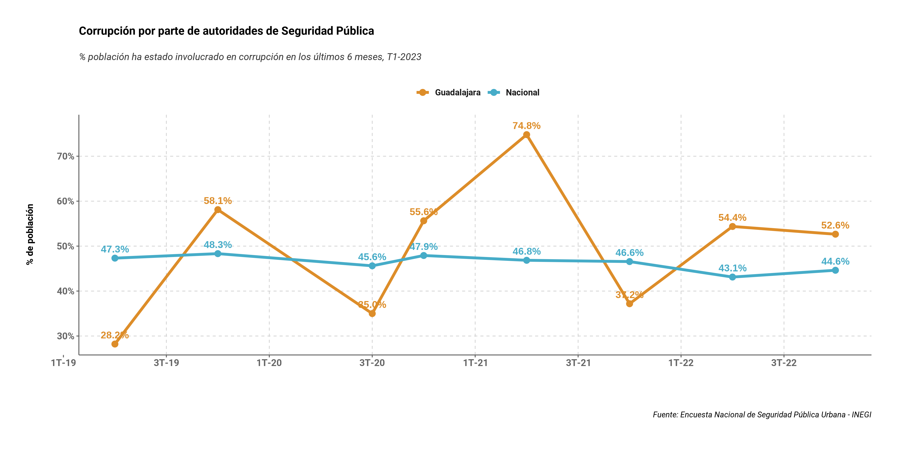

---
class: inverse center middle
### Corrupción por parte de autoridades de seguridad pública

Al ser un análisis semestral, la encuesta no nos permite conocer a detalle las posibles causas de la calificación de corrupción. Sin embargo, **la tendencia nacional se mantiene estable justo por debajo del 50%**, mientras que Guadalajara cuenta con altibajos que no podrían considerarse dentro de una tendencia. Solo **los últimos dos semestres** muestran una estabilidad **por encima del 50%**.

---
### Expectativas en los próximos 12 meses

.pull-left[

**Solo una de cada cuatro personas piensa que la seguridad de Guadalajara mejorará**. Se encuentra 26.6 puntos por debajo del promedio nacional y, aún con la disminución en septiembre de 2022, no cuenta con un cambio representativo desde finales de 2021.
]


.pull-right[
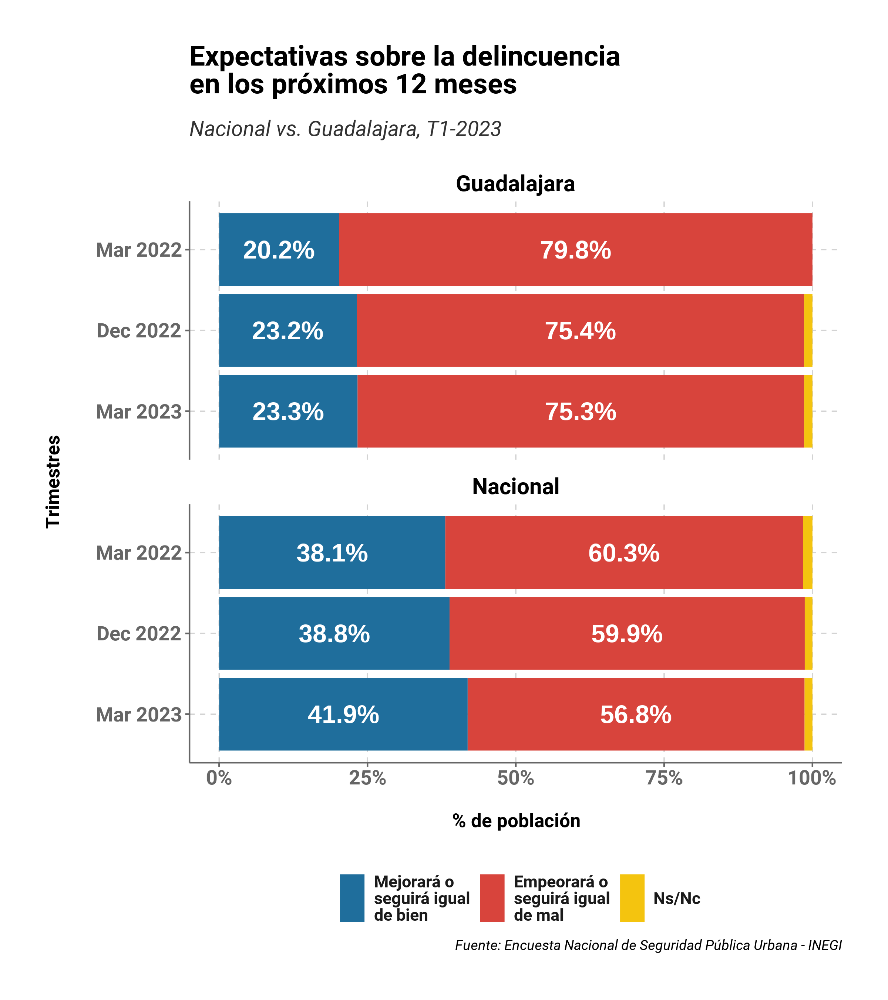
]

---
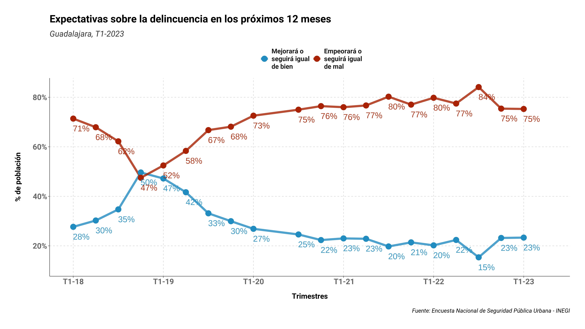

---
### .orange[Conocimiento de los programas para la prevención de delitos]

.pull-left[
El conocimiento de los programas para la prevención de delitos se estudió por primera vez en en último trimestre de 2022. Entre ese trimestre y el actualhubo un crecimiento de 11.1% en Guadalajara, y más del 44% de los encuestados conoce los programas. Sin embargo, aún hay poca información para analizar a fondo estos datos.
]

.pull-right[
```{r echo=FALSE, message=FALSE, warning=FALSE}
kableExtra::kable_styling(kableExtra::column_spec(knitr::kable(tabla_programas, format="html"), 1, bold=TRUE), font_size = 12) 
```
]

---

## Lo positivo 

- **La confianza en la policía municipial y estatal sigue creciendo**. A pesar de que aún son las dos autoridades con menor confianza, son quienes más han mejorado.

- A pesar de aún no poder romper la barrera del 80%, **la percepción de inseguridad se mantiene a la baja** y empareja sus mejores números de los últimos 4 años.

- Hace dos trimestres la efectividad de gobierno obtuvo su calificación más baja. Desde entonces ha ido repuntando y **en seis meses la efectividad de gobierno recuperó 6.1%**.

- **Guadalajara es la ciudad que más ha repuntado en el último año**. Después de tener su peor calificación a inicios de 2022, se ha recuperado.

- **La escuela ya se recuperó como espacio seguro**. El peligro que se veía el año pasado ya se dejó atrás.

- **Tanto la atestiguación de delitos como los problemas de la ciudad siguen a la baja**.

---
class:inverse
## Lo negativo  

- A pesar de la mejora de percepción, **Guadalajara sigue con los números más altos del AMG**.

- La mayor percepción de inseguridad se encuentra en los **Bancos** (86.1% en ATM y 77.2% en sucursal), el **Transporte público** (78.7%), las **Calles** (66.2%) y los **Parques** (54.6%). Y tampoco debemos dejar de lado el crecimiento de sensación de inseguridad en el **Trabajo**, **Transporte Público** y la **Casa**.

- **Delincuencia** (+12.9pp), **Recolección de basura** (+12.1pp) y **Embotellamientos** (+5.3pp) presentan un crecimiento importante desde el trimestre anterior.

- Los problemas más grandes de la ciudad para los tapatíos son la **Delincuencia** (70.1%), la **Movilidad** (67.2% en baches y 60.2% en tráfico) y el **Alumbrado público** (50.6%).

---
class: inverse center middle


# Encuesta Nacional de Seguridad Pública Urbana
## Guadalajara
**Primer Trimestre - 2023**


